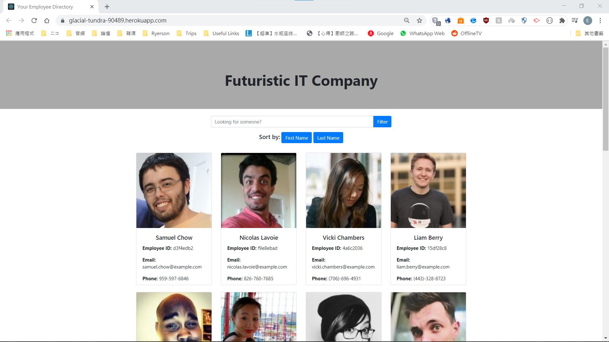
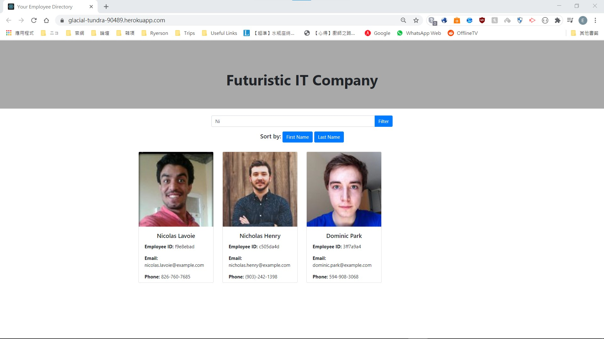

# Employee-Directory
Goal: To make an employee directory with quick and effective sorting and filtering 
This project has the follwogin abilites:
- Able to display employees as *cards* with basic info
- Able to sort the employees by *first/last* name *note: only descending order at the moment*
- Able to search for a specific employee by *filtering*

 

This project contains the following files:
- public folder: contains auto-generated files for the client-side, e.g. HTML file and icons
- src folder: contains files for building the HTML file for the client-side
- src/index.js: contains codes for initialize React rendering
- src/App.js: contains codes for handling events caused by the end-user as well as returning the HTML codes for the client-side
- src/components folder: contains component files for building individual parts of the client-facing HTML file, i.e. *Brandbanner.js, Card.js and Searchbar.js*
- src/css folder: contains CSS files for styling the HTML
- src/utils folder: contains an orm file for sending API calls, i.e. *orm.js*
- package.json: contains basic info for the project such as packages used and start codes

 

This project was built using **HTML5**, **CSS**, **Bootstrap**, **JavaScript**, **React.js** and **Random User Generator API** 
This project is currently hosted on Heroku: https://glacial-tundra-90489.herokuapp.com/

## The Webapp

### Filtering for certain employee/user
- It can filter the list by checking if the entered string is included in the first name of any employees

### Sorting
- As of now, it can sort the list by *first name* or *last name* in descending order alphabetically by pressed the *First Name* or *Last Name* button